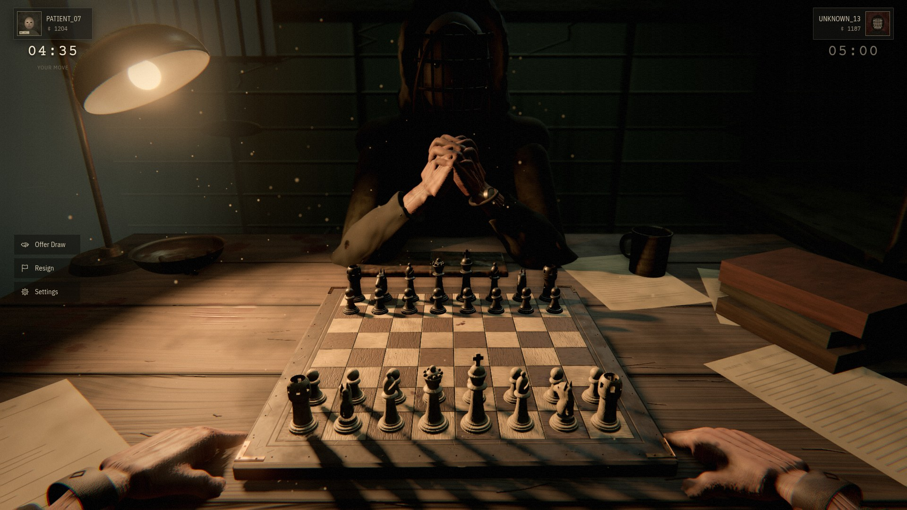
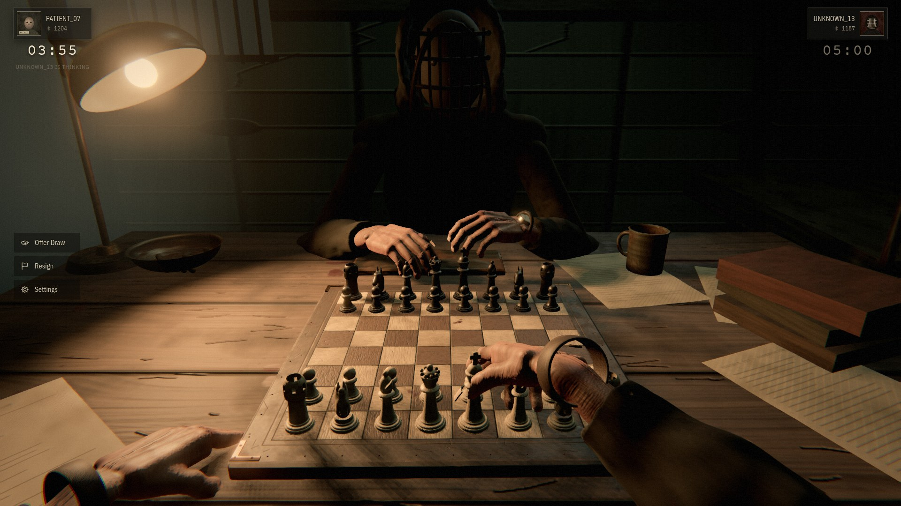
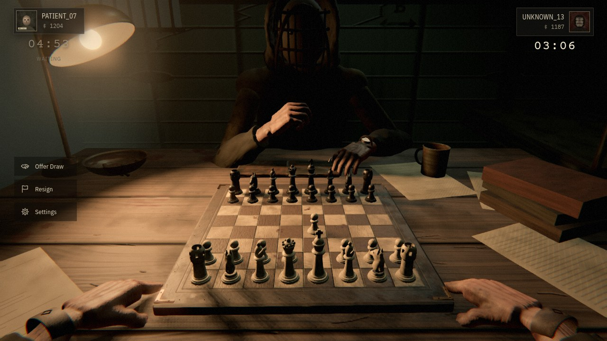
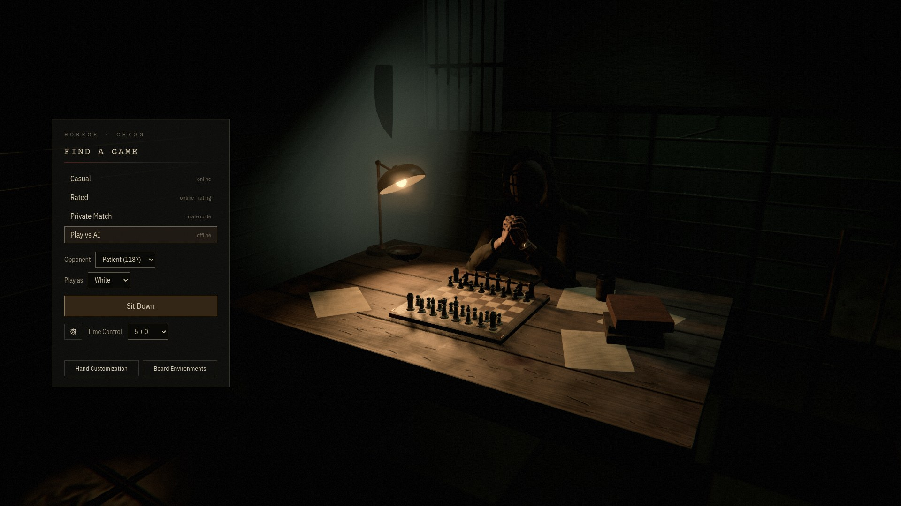
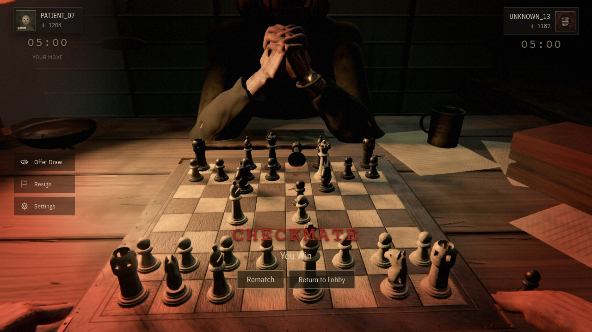
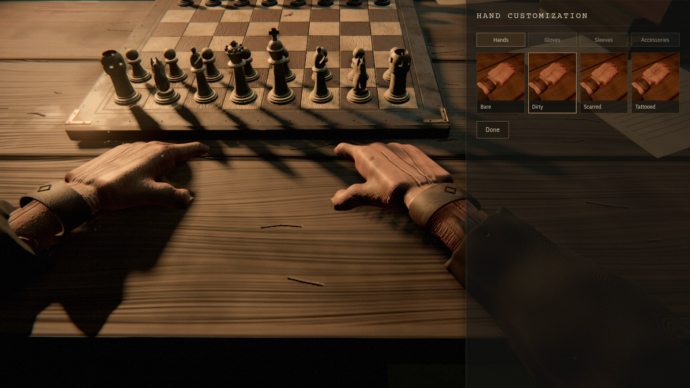
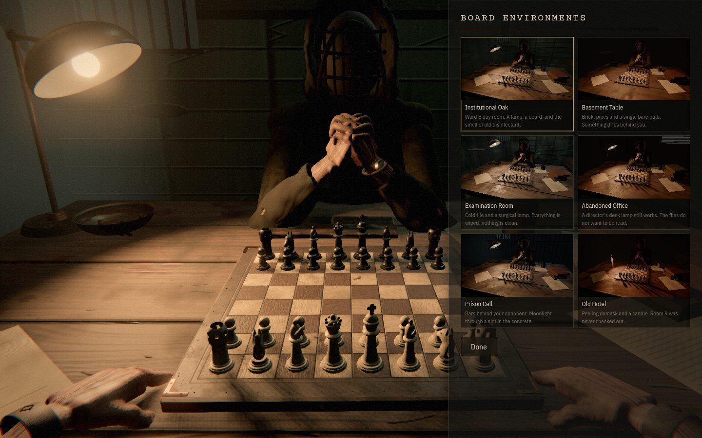
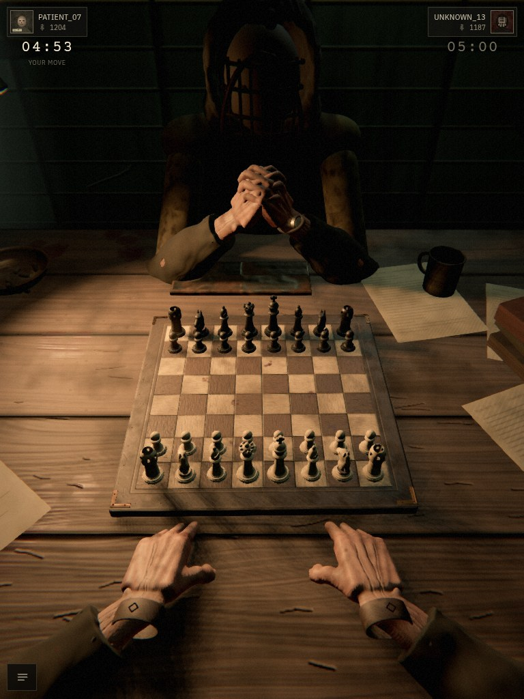
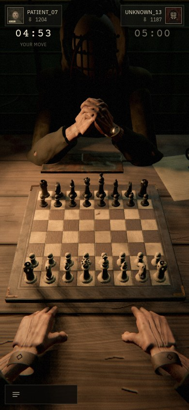

# Horror Chess — Build Report

Status as of 2026-10-02. This report follows the deliverables format from the build specification:
what was implemented, which files, how to run it, what remains, and technical limitations.



## 1. Outcome

Horror Chess is playable in the browser:

- **Single player** against a local AI, with no server needed.
- **Online** (casual, rated or private tables) through an authoritative WebSocket game server.

All art and sound are generated procedurally in code and are original. The visual target was the concept image in
[`reference/concept-reference.jpg`](reference/concept-reference.jpg).

It does not reach photographic or "DLSS-realistic" fidelity. The scene is lit and shaded physically and the
composition follows the reference closely. The hands, opponent and props are still procedural models, not scanned
assets.

## 2. Verification

| Check | Result |
| --- | --- |
| Unit and integration tests (`npm test`) | 17 passed |
| Typecheck of all three packages | Clean |
| Production build (`npm run build`) | Succeeds, workers bundled |
| Two-browser online test (`tools/e2e-online.mjs`) | Passed |
| Visual checks against the reference | 1920×1080, 1440×900, 768×1024, 390×844 |

The server tests cover the following:

- Rejection of out-of-turn, illegal, stale and opponent-piece moves.
- Rejection of malformed messages.
- Checkmate, resignation with Elo changes, and draw offer and acceptance.
- Private tables by code, reconnect with full state restore, rematch with swapped colours, and flag fall.

The online test paired two headless browsers through the real server. Each saw the other's moves. The server refused
Black's attempt to move a white piece, and resignation ended the game for both.

Not visually checked: 1600×900, 1366×768, 393×852 and 430×932.

## 3. What was implemented

### Scene and visuals
- **Camera:** a first-person view with breathing, very slight idle sway, a lean toward the board when moving, and
  attention shifts toward the opponent's moves.
- **Materials:** generated in code. They cover the worn plank table, an aged board with brass corners and rivets,
  tiles, plaster, floors, fabric, leather, metal and skin.
- **Pieces:** turned Staunton-style bodies with sculpted knight, bishop, rook, queen and king heads. Each piece has
  slight imperfections and casts a contact shadow.
- **Hands:** anatomical forearms and hands with a 17-bone skeleton, nails, tendons, veins and knuckle creases.
  Two-bone IK drives every reach.
- **Opponent:** a hunched figure in institutional clothing, with a hood and an original riveted iron cage mask. It
  breathes, moves its head slightly, clasps its hands while thinking, and reaches across to move pieces.
- **Environments:** Institutional Oak, Basement Table, Examination Room, Abandoned Office, Prison Cell and Old Hotel.
- **Lighting and post-processing:** a warm lamp key light, cold fluorescent fill and a rim light. Filmic tone
  mapping, ambient occlusion, bloom, depth of field, a grade toward olive and brown, vignette and grain.
- **Atmosphere:** dust motes that only show inside the lamp's light, and a faint light shaft from the window.

### Gameplay
- Select a piece, see legal-move marks, then watch the hand reach, grip, lift, carry, place, release and return.
- Captures take the victim with the tucked fingers and set it down beside the board.
- Castling, en passant, a promotion picker, check feedback, clocks with increments, draw offers, resignation and
  rematch.
- Game over: the camera slowly settles on the final position, the ambience fades, the losing king tips over, then
  CHECKMATE and You Win or You Lose appear with Rematch and Return to Lobby.
- The AI is an alpha-beta engine in a Web Worker with three strengths.

### Interface
- Player plates and clocks top-left and top-right, and Offer Draw, Resign and Settings on the left, as in the
  reference.
- Lobby (Find a Game), hand customization with rendered previews, an environment picker with rendered thumbnails,
  and a settings panel.
- Accessibility settings: reduced motion, reduced camera movement, reduced horror effects, increased piece contrast,
  larger board, simplified environment, three volume sliders, and a competitive mode with instant moves.
- An intentional portrait layout for phones and tablets, with a collapsible menu.

### Audio
- Synthesized live in the browser: electrical hum, air, room tone, distant pipes, creaks, footsteps, metal and drips.
- Piece pickup, placement and capture sounds, clock ticks, button clicks and a quiet drone.

### Server
- The server owns legal moves, the turn, the clocks and the result. The client can only send requests.
- Identity is an anonymous token stored hashed. Messages are validated by schema and rate limited per socket.
- Matchmaking for casual and rated games, private tables with codes like `GAME-8F3A21`, and Elo ratings.
- A disconnected player keeps their seat for 60 seconds. Reconnecting restores the full authoritative state.

## 4. Files

```
packages/shared/   rules wrapper, clock, protocol schemas, types
packages/server/   players.ts, room.ts, hub.ts, index.ts
packages/client/
  src/render/      textures, SDF mesher, worker asset pipeline, post-processing
  src/scene/       world, camera, board, pieces, hands, arms, opponent, environments, move choreography
  src/game/        sessions, presenter, AI engine
  src/net/         network client and session
  src/ui/          HUD, lobby, customization, environments, settings, styles
  src/audio/       procedural audio
tools/             screenshot helper and online end-to-end script
docs/              this report, the session summary, screenshots, concept reference
```

## 5. How to run

```bash
npm install
npm run dev            # client at http://localhost:5173 (Play vs AI)
npm run dev:server     # game server, needed for Casual, Rated and Private
npm test
npm run start          # production: builds the client and serves it plus /ws on port 8787
```

## 6. Decisions that differ from the spec

- **Camera angle:** about 19° downward instead of 8–14°. At 8–14° the board, hands and opponent cannot all fit in
  frame the way they do in the reference.
- **Opponent name:** "UNKNOWN_13". The reference shows "MurkoffGuest", which comes from Outlast.
- **Voice-chat waveform:** omitted, because there is no voice chat behind it.

## 7. What remains

- Scanned or artist-made hand and character assets for higher realism.
- Move list and PGN export, spectating and voice chat.
- A real database and accounts in place of the JSON file and anonymous tokens.
- Visual checks at the four untested resolutions.

## 8. Technical limitations

- The first load generates all materials. That takes a few seconds on a desktop and longer on phones. Later visits
  load from the browser cache, which resets with each new build.
- Ratings use plain Elo with K = 32. There is no detection of players using engines.
- Player data persists to `server-data/players.json`.

## Screenshots

| | |
| --- | --- |
|  |  |
|  |  |
|  |  |
|  |  |

## Photorealistic rendering phase — status

| Phase | Status |
| --- | --- |
| 0 Repository audit | Done |
| 1 Hardware audit | Done ([PERFORMANCE.md](PERFORMANCE.md)) |
| 2 Engine evaluation | Done: UE5 primary, Godot 4 fallback ([RENDERING.md](RENDERING.md)) |
| 3 UE5 benchmark scene | **Done.** 1440p HIGH with TSR at 67%: 64.5 fps, 1% low 59.6, 3.1 GB VRAM. Full matrix in PERFORMANCE.md |
| 4 Proxmox GPU configuration | **Done.** VM 131 with the RX 6650 XT passed through. Mesa 26.2.3 is required for UE hardware ray tracing |
| 5 Pixel Streaming | **Blocked by an engine limitation.** UE 5.8's only Linux hardware encoder is NVENC, and AMF is Windows-only. Options A–D are in RENDERING.md and need the owner's decision |
| 6–19 | Not started |

## Master directive: audit, roadmap and Milestone 1 (2026-10-03)

- **Audit and roadmap.** [ROADMAP.md](ROADMAP.md), revised after an adversarial review by a critique agent.
- **Milestone 1, core foundation: complete.** The item-by-item table is in ROADMAP.md §5.
- **Tests and builds.**
  - 305 automated tests, run three times in a row with no failures.
  - Typecheck of all four packages is clean.
  - The client build passes.
  - Both end-to-end scripts (online and offline) pass.
- **Agents used:**
  - critique (roadmap review; findings adopted or answered in ROADMAP.md);
  - rules (123 FIDE fixture cases plus a chess.js deviation report);
  - character design ("The Annotator": [CHARACTERS.md](CHARACTERS.md) and `content/characters/`);
  - GitHub (keeps draft PR #1 current at each checkpoint).
